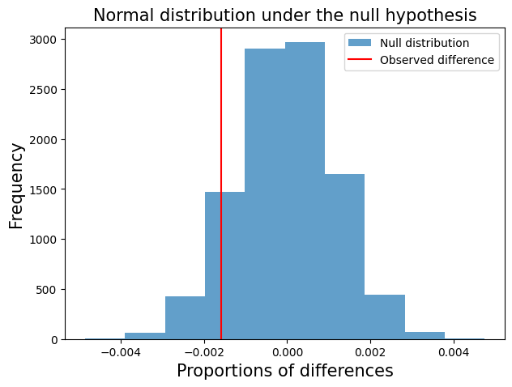

# A/B Testing Analysis for an Ecommerce Website

This work is an analysis of A/B test results provided provided from an e-commerce website to test the user response to a new webpage design.

The analysis aims to provide insights that help the decision makers in deciding whether to:

- Implement the new webpage,
- Keep the old webpage, or
- Expand the scope of the A/B testing

  

#Methodology:
  The analysis is devided into 3 sections:
  - Exploraty Data Analysis (EDA)
  - Data cleaning
  - Probability Analysis
  - A/B Hypothesis Testing (via Bootstrapping)
 
#Analysis

  The complete analysis is provided in the [Jupyter Notebook file](AB-Test-Analysis.ipynb)

#Results
  #Probability Analysis:

- The conversion rate of an individual regardless of the page they receive is 0.119
- The conversion rate of an individual to the new page is 0.118
- The conversion rate of an individual to the old page is 0.12
- The rate receiving of an individual to the new page is 0.5016
- The rate receiving of an individual to the old page is 0.498
- The difference observed in the conversion rate between the two pages is -0.001

  #A/B Hypothesis Testing:

  The calculated p-value is significantly higher than the significance level α (0.05). We therefore fail to reject the null hypothesis$(H_0)$, which on the other hand means that there is no difference in the observations of both webpages, and that the conversion rate of the new webpage is not greater than the conversion rate of the old webpage.

#Conclusion
The results from A/B test shows that the new page has no statistically significant effect on the conversion rate.

